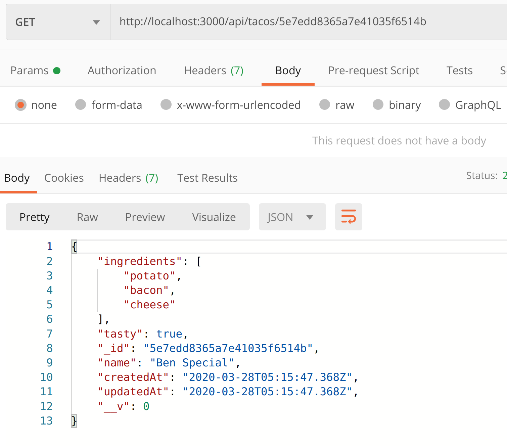
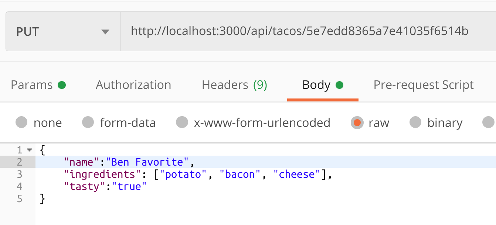
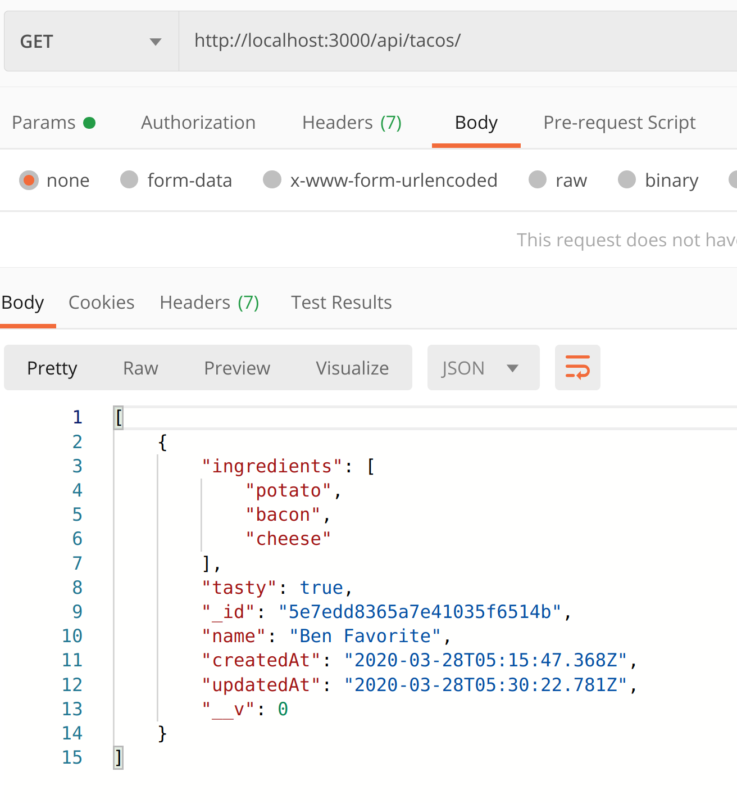
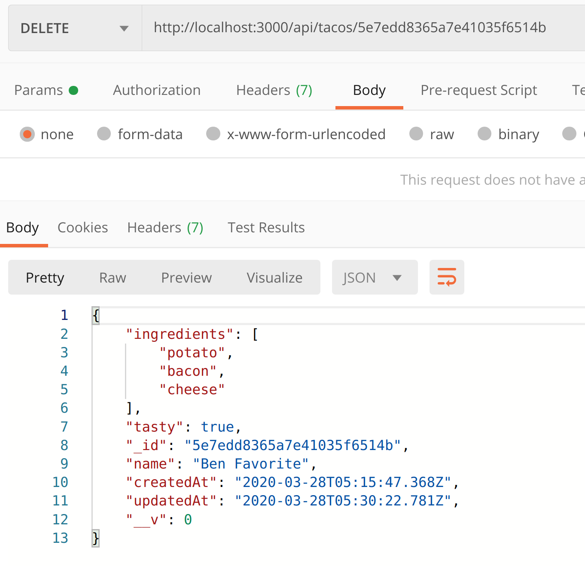
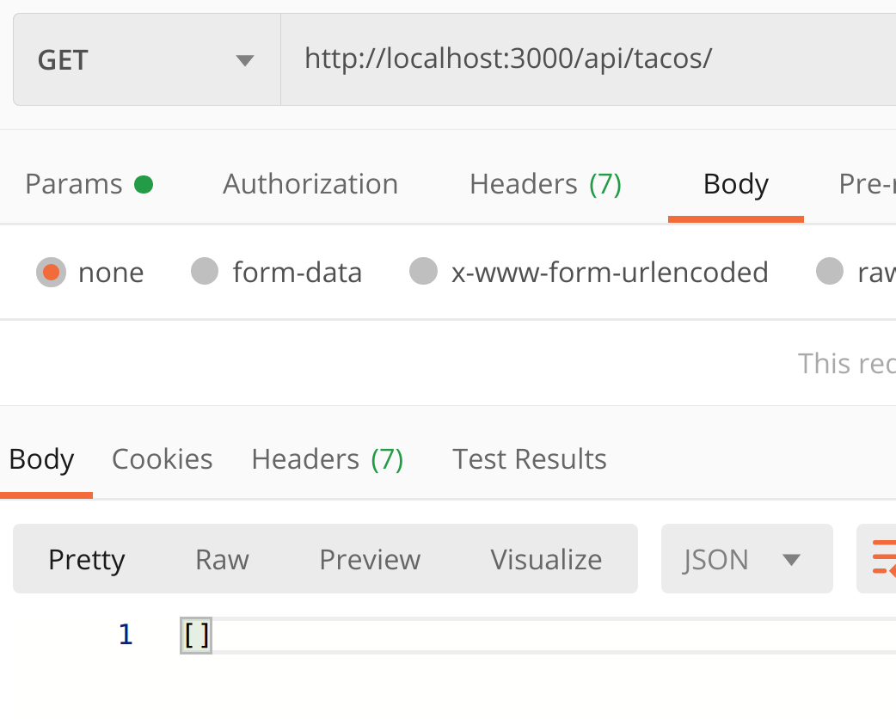

# node-backend-api-tutorial
## Start off by creating a node/express application using the express generator, then navigate into the directory:
```
express -e node-backend-api-tutorial
cd node-backend-api-tutorial
npm i
```
## First things first, let's rename app.js to server.js and adjust the www file (line 7) in the bin directory:
```
mv app.js server.js
```
```js
var app = require('../server'); // Line 7 should look like this now
```
## We need to enable cross origin resource sharing to allow connections to the server.  Install the npm package, then define and use it in server.js:
```
npm i cors
```
```js
const cors = require('cors');
.
.
.
app.use(cors());
```
## We'll be utilizing a local MongoDB database, so let's configure that next.  Create a config directory and create database.js inside of it.  This is where the mongoose configuration goes:
```
mkdir config
touch config/database.js
npm i mongoose
```
```js
var mongoose = require('mongoose');

mongoose.connect('mongodb://localhost/tacos',
{ useNewUrlParser: true, useCreateIndex: true, useUnifiedTopology: true }
);

var db = mongoose.connection;

db.on('connected', function () {
  console.log(`Connected to MongoDB at ${db.host}:${db.port}`);
});
```
## Don't forget to require the database connection in server.js:
```js
require('./config/database');
```
## Start up the server with nodemon and open up the Postman application to test it out.  Send a get request to http://localhost:3000.  You should receive a response containing the contents of the index.ejs page.  

## Since we're not going to use the 'users' route that is already configured, let's change the name to something more appropriate:
```
mv routes/users.js routes/api.js
```
## Change the required items in server.js to match the name change:
```js
var usersRouter = require('./routes/users');
// Change the above line to:
var apiRouter = require('./routes/api');
.
.
.
app.use('/users', usersRouter);
// Change the above line to:
app.use('/api', apiRouter);
```
## Check that the route is working properly by using Postman.  A get request to http://localhost:3000/api should show our res.send message inside of api.js:

## Now that our api route is set up, we can start working with data!  Let's start by creating a model:
```
mkdir models
touch models/taco.js
```
## Write the code for the model in taco.js:
```js
var mongoose = require('mongoose');
var Schema = mongoose.Schema;

var tacoSchema = new Schema({
    name: {
        type: String,
        required: true
    },
    ingredients: [String],
    tasty: {
        type: Boolean,
        default: false
    }
},{
    timestamps: true
}
);

module.exports = mongoose.model('Taco', tacoSchema);
```
## Now that we have our model, we need to configure our routes and controller:
```
mkdir controllers
touch controllers/tacos.js
```
## Set up the basics for the controller:
```js
const Taco = require('../models/taco');

module.exports = {
}
```
## Add the controller to the api.js routes file and set up simple routes to create and index our tacos:
```js
var express = require('express');
var router = express.Router();
var tacosCtrl = require('../controllers/tacos');

router.get('/tacos', tacosCtrl.index);
router.post('/tacos', tacosCtrl.create);

module.exports = router;
```
## Next, write the index and create functions in the controller:
```js
const Taco = require('../models/taco');

module.exports = {
    index,
    create
}

function index(req, res) {
    Taco.find({})
    .then(function(tacos){
        res.status(200).json(tacos);
    })
    .catch(function(err) {
        res.status(500).json(err);
    })
}

function create(req, res) {
    Taco.create(req.body)
    .then(function(taco){
        res.status(201).json(taco);
    })
    .catch(function(err) {
        res.status(500).json(err);
    })
}
```
## We've got two basic routes functioning, so let's go test them out in Postman.  Send a post request to http://localhost:3000/api/tacos and put a JSON object in the body of the request using the same format as the model:

## Now, send a get request to http://localhost:3000/api/tacos and make sure it was added properly to the database:

## Now we need to add a route for showing an individual taco:
```js
router.get('/tacos/:id', tacosCtrl.show);
```
## ...and write the function in the controller:
```js
function show(req, res){
    Taco.findById(req.params.id)
    .then(function(taco){
        res.status(200).json(taco);
    })
    .catch(function(err) {
        res.status(500).json(err);
    })
}
```
## Test it out in Postman using the _id of one of the entries in the database:

## Next, we'll add the update route:
```js
router.put('/tacos/:id', tacosCtrl.update);
```
## ...and write the controller function:
```js
function update(req, res){
    Taco.findByIdAndUpdate(req.params.id, req.body, {new: true})
    .then(function(taco){
        res.status(200).json(taco)
    })
    .catch(function(err) {
        res.status(500).json(err);
    })
}
```
## Once again, test it out by making a put request with the desired changes in the body:

## ...then verify that the changes were made by sending a get request to the index route:

## All that's left is delete functionality.  Start with the route:
```js
router.delete('/tacos/:id', tacosCtrl.delete);
```
## ...then the controller function:
```js
function deleteOne(req, res){
    Taco.findByIdAndRemove(req.params.id)
    .then(function(taco){
        res.status(200).json(taco);
    })
    .catch(function(err) {
        res.status(500).json(err);
    })
}
```
## Test it out using Postman:

## And verify with a get request to the index:

## Congratulations, you now have a backend server capable of performing full CRUD!


